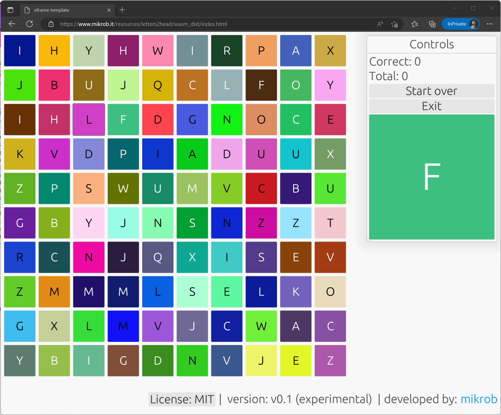
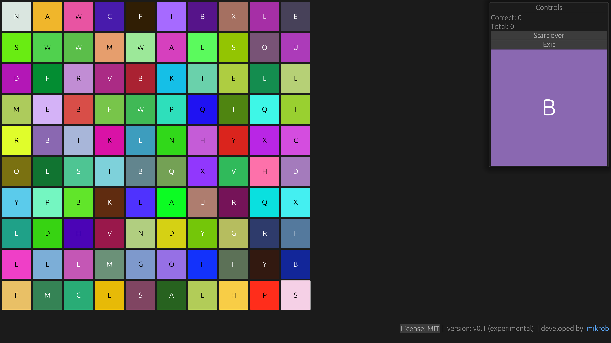

# letters2head

Teach kids to recognize letters or simply relax with this little game. It was created as a WebAssembly (WASM) prototype for a little Rust application, does not require any download and can be played in your browser. 

**Build & run**

If you wish to test out the app straight away, get it from the [app's page](https://www.mikrob.it/letters2head_app_detail.php) on [mikrob.it](https://www.mikrob.it).

Alternatively:
* Clone & build
* Execute letters2head.exe, interact with the app through the GUI

**Notes**

* None

**Screenshots**

